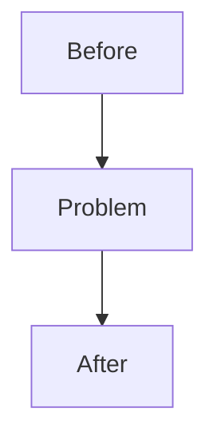

# 07 Report

Purpose: create the durable learning and portfolio artifact.

Read:

- `.harness/artifacts/02-context.md`
- `.harness/artifacts/05-evidence.md`
- `.harness/artifacts/06-evaluation.md`
- Existing `docs/progress/_template.md`
- Nearby progress docs for tone and density.

Create or update `docs/progress/phase-XX-*.md`.

Recommended structure:

````markdown
# Phase N: 제목

> 완료일: YYYY-MM-DD

## 구현 요약

- ...

## 학습 노트

- 핵심 개념:
- 트레이드오프:
- 포트폴리오에서 말할 점:

## 설계



## Evidence

| Claim | Evidence | Result | Notes |
|-------|----------|--------|-------|
| ... | ... | ... | ... |

## 테스트 결과

```bash
...
```

## 트러블슈팅

- ...
````

If the phase has performance goals, include a `## 측정 결과` table. If it does not, use `## 검증 결과` or `## Evidence`. Avoid duplicating long explanations already present in the phase plan.

Produce `.harness/artifacts/07-report.md` with:

```markdown
# 07 Report

## Progress Document

- Path:
- Sections written:
- Diagrams:
- Evidence tables:

## Notes

- Deferred documentation:
- Anything intentionally omitted:
```
