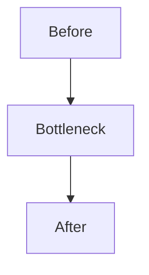

# Phase Harness

Use this skill as an orchestrator for implementing one phase or a bounded set of tasks from the phase plans. Keep short-lived harness state in `.harness/` and final learning artifacts in `docs/progress/`.

Optimize for three outcomes:

1. Correct code that follows the existing architecture.
2. A clear learning trail: concepts, trade-offs, measurements, and diagrams.
3. Portfolio-ready evidence without bloated or repetitive writing.

Keep the project voice: Korean, technical, direct, no emoji, no marketing tone.

## Artifact Pipeline

Create `.harness/artifacts/` when the workflow starts. Each stage writes a concise artifact for the next stage:

```text
01-clarify.md
  -> 02-context.md
  -> 03-plan.md
  -> 04-implementation.md
  -> 05-evidence.md
  -> 06-evaluation.md
  -> 07-report.md
```

Optional state files:

- `.harness/tasks.json`: task list and status when the phase has many steps.
- `.harness/decisions.md`: user decisions that affect scope, review findings, or deferred work.

`.harness/` is working state. Do not commit it unless the user explicitly asks. The durable output is the code, tests, evidence scripts, benchmark results when applicable, and `docs/progress/phase-XX-*.md`.

## Phase Instructions

Use the phase prompt files in this directory:

- `phases/01-clarify.md`
- `phases/02-context.md`
- `phases/03-plan.md`
- `phases/04-implement.md`
- `phases/05-evidence.md`
- `phases/06-evaluate.md`
- `phases/07-report.md`

When subagents are authorized and available, run the relevant phase prompt in a subagent and require it to write the expected artifact. When subagents are unavailable or not authorized, run the same phase locally and write the artifact yourself.

## Orchestration Flow

### 1. Clarify Scope

Run `phases/01-clarify.md`. Present material questions to the user, record answers in `.harness/artifacts/01-clarify.md`, and continue only after scope is clear.

### 2. Deep-Dive Learning Note

Run `phases/02-context.md`. Include the learning brief in `.harness/artifacts/02-context.md` so it can feed both implementation and the final progress document.

### 3. Inspect Structure And Code

The context phase must inspect the phase plan, roadmap, progress docs, backend guidance, and relevant code. Prefer `rg`, `rg --files`, `sed`, `nl`, and `git diff`. Preserve unrelated user changes.

### 4. Build A TDD Plan

Run `phases/03-plan.md`. The plan must include RED/GREEN/REFACTOR slices, evidence commands or checks, documentation outputs, risk notes, and acceptance criteria.

### 5. Senior Plan Review

Review `.harness/artifacts/03-plan.md` before implementation. Use a subagent when authorized; otherwise do a local senior review. Record findings and recommendations in `.harness/decisions.md`.

### 6. Ask Before Applying Review Changes

Show the user:

- Implementation plan summary.
- Senior review findings.
- Which findings you recommend applying now.
- Which findings are optional or deferred.

Ask whether to apply the review changes before coding. If the user already gave explicit permission to proceed without another checkpoint, continue and document the assumption.

### 7. Implement With TDD

Run `phases/04-implement.md`. Work in small vertical slices and update `.harness/tasks.json` if it exists. For evidence or infra tasks where classic unit TDD does not fit, create executable verification scripts, benchmark checks, smoke checks, or audit checks first, then make them pass.

### 8. Collect Evidence

Run `phases/05-evidence.md`. Evidence means whatever proves the phase goal:

- Performance: benchmark, EXPLAIN ANALYZE, p95/p99, throughput.
- Correctness: tests, invariants, duplicate prevention, state transitions.
- Consistency: retry behavior, idempotency, drift checks, consumer replay.
- Operations: health checks, failover behavior, dashboards, traces.
- Deployment: smoke checks, endpoint reachability, rollback evidence.

For performance phases, capture before/after values using the same command, dataset size, and environment. For non-performance phases, capture claim/evidence/result rows. Do not claim success without evidence.

### 9. Evaluate Like A Reviewer

Run `phases/06-evaluate.md`. Include targeted tests, broader checks when needed, evidence validity, and a final senior-style review of diff, tests, evidence, and docs.

### 10. Write The Phase Result Document

Run `phases/07-report.md`. Create or update a concise Markdown progress note under `docs/progress/`.

Use the existing template and tone. Include only what helps future recall:

````markdown
# Phase N: 제목

> 완료일: YYYY-MM-DD

## 구현 요약

- 핵심 변경 사항
- 주요 파일/구조

## 학습 노트

- 개념
- 트레이드오프
- 면접/포트폴리오에서 말할 포인트

## 설계



## Evidence

| Claim | Evidence | Result | Notes |
|-------|----------|--------|-------|
| ... | ... | ... | ... |

## 테스트 결과

```bash
...
```

## 트러블슈팅

- 문제와 해결
````

Diagram guidance:

- Prefer Mermaid in Markdown for architecture, flow, sequence, and state transitions.
- Use Excalidraw only when the user explicitly asks or the visual is too spatial for Mermaid.
- Keep diagrams small enough to read in a PR.

Writing guidance:

- No emoji.
- Avoid repeated explanations already present in the phase plan.
- Prefer tables for trade-offs and measurements.
- Explain why the result matters, not every mechanical edit.

## Completion Report

End with:

- What changed.
- What tests and evidence checks ran.
- Where the progress document is.
- Any unresolved risks or skipped checks.
- Commit/PR status only if the user asked for it.

Do not leave needed dev servers, long-running tests, or subagents dangling.

## Error Handling

- If a phase artifact is missing or malformed, rerun that phase.
- If a subagent reports a blocker, present the blocker and a recommended next step.
- If the user says "redo phase N", rerun only that phase and downstream phases affected by it.
- If tests or measurements cannot run, document the exact blocker and do not claim completion.
