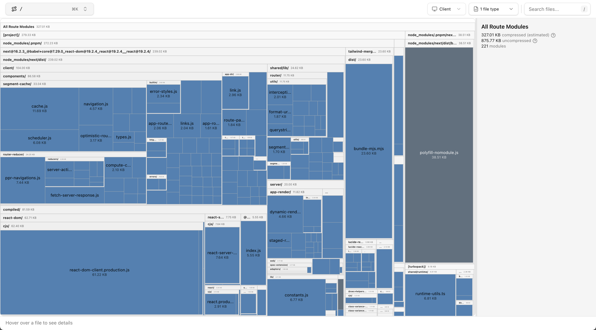

# FE-1 기준값 (Baseline)

측정일: 2026-04-18
환경: MacBook (로컬), Chrome, 네트워크 쓰로틀링 없음

## Lighthouse (프로덕션 빌드)

| 지표 | 값 |
|------|-----|
| Performance 점수 | 98 |
| FCP | 0.2 s |
| LCP | 0.5 s |
| TBT | 0 ms |
| CLS | 0.093 |
| Speed Index | 0.4 s |
| TTI | 0.5 s |

### 특이사항

- 데이터 건수가 20건(mock 기본값)으로 적어 성능이 매우 좋게 측정됨. 실 부하 시나리오(10만건 등)와 수치 차이가 클 것으로 예상.
- CLS 0.093: 게시글 목록이 클라이언트 fetch 완료 후 일괄 렌더링되면서 레이아웃이 밀리는 것이 원인으로 추정. Skeleton UI가 있으나 높이가 실제 콘텐츠와 다를 수 있음.
- TBT 0 ms: 현재 JS 번들이 메인 스레드를 블로킹하지 않음. 데이터 증가 시 변화 가능성 있음.
- 미사용 JS 64 KiB: `12ocnbclxlrb2.js`(222 KB 공유 청크)에 현재 라우트에서 쓰이지 않는 모듈 포함(25.9 KB 절감 가능). 번들 최적화 단계에서 다룰 항목.
- Legacy JavaScript 13 KiB: 구형 브라우저용 폴리필(`polyfill-nomodule.js`) 포함. 현대 브라우저만 타겟으로 좁히면 제거 가능.

## React Profiler (개발 서버)

총 7커밋. 타임스탬프·유발자(updater) 포함:

| 커밋 | 시각(ms) | 소요 시간 | 유발자 | 설명 |
|------|---------|---------|-------|------|
| 0 | 48.4 | 3ms | - | 페이지 초기 마운트 |
| 1 | 51.7 | 0.2ms | AppRouterAnnouncer | 라우터 업데이트 |
| 2 | 54.5 | 0.2ms | - (Idle) | passive 업데이트 |
| 3 | 134.1 | 7.1ms | **MSWProvider** | MSW 활성화 → PostList 마운트·fetch 시작 |
| 4 | 157.0 | 6.6ms | **PostList** | `setLoading(true)` → Skeleton 8개 렌더 |
| 5 | 161.8 | 0.2ms | - | passive 업데이트 |
| 6 | 233.1 | **40.2ms** | **PostList** | `setPosts(data)` → PostCard 20개 일괄 렌더 |

**PostList self 시간**: 커밋 6 기준 1.6ms (자식 제외, 자체 렌더 비용)

**PostCard ×20**: 커밋 6에서 일괄 렌더. 평균 1.75ms/개 (범위 1.6~2.3ms), 합산 ~36ms

### 특이사항

- `changeDescriptions: null` — Profiler 설정에서 "Record why each component rendered" 미활성. 이유 추적 불가.
- fetch 시작(134ms) → 데이터 수신(233ms): 약 **100ms 소요** (로컬 mock API 기준).
- `setLoading(true)` (커밋 4, 157ms)와 `setPosts(data)` (커밋 6, 233ms)가 별도 setState → 커밋 2회 분리. 하나로 묶으면 커밋 1회 절약 가능.
- PostCard 20개를 단일 커밋에서 동기 렌더링 → 데이터 증가 시 선형 비례. FE-2(10만건)에서 병목 지점.

## 번들 크기 (빌드 결과, experimental-analyze)

| 항목 | compressed | uncompressed |
|------|-----------|--------------|
| [project]/ (내 코드) | 279.33 KB | - |
| All Route Modules (전체) | 327.01 KB | 875.77 KB |

## 메모리 사용량 (Heap Snapshot, 프로덕션 빌드)

초기 로딩 후: **5.83 MB** (109,581 노드)

| 타입 | 크기 |
|------|------|
| code (JS 함수 코드) | 2,218 KB |
| native (브라우저 내부) | 1,312 KB |
| hidden (V8 내부) | 608 KB |
| array | 470 KB |
| object shape | 453 KB |
| object | 345 KB |
| closure | 269 KB |
| string | 240 KB |

> `code` 2.2 MB는 React·Next.js 런타임으로 데이터 증가와 무관하게 고정. 데이터 증가 시 `object`·`array`·`string`이 주로 증가.

---

다음 측정: FE-2 (10만건 렌더링 시 병목 체험)
